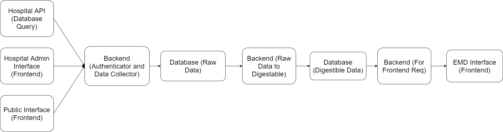

# covidoptimize

This is a community driven initiative to help the Emergency Medical Dispatcher (EMD) make a better decision on where to direct an ambulance carrying a patient during the surge of infected patients.

Please have a playthrough the demo to get an idea of what we're trying to do. The demo can be found [here](https://www.covidoptimize.org) and it's repo can be found [here](https://github.com/ahmadshahrour951/syringe)

## Architecture

From the top my head, this is how I see the architecture will look like:

Please give some suggestions if you think this architecture seems off or if you have any advice on a better layout (maybe we dont need to commit to something as intense as this?)

Data will flow in from the three tails of the diagram (in order of priority):
1. Hospital Databases:  
If a hospital has RESTful API infrastructure (or readonly slave DB access) we can simply do a cronjob to request data.
  
2. Hospital Input (A Web Interface?):  
This is input from an frontend interface we'll build for the hospital if option 1 doesn't work, which most probably won't.. (This is like a plan B for data input)
  
3. User Input (A Web Interface?):  
If both of the upper options won't work, we can build this in tamdem. A frontend for the user to input ER waiting time and triage status. (Plan C for data input)

These tails will be fed into a database in a RAW format (maybe was can use elasticsearch or mongo?) using a backend which is responsible for recieving and storing data.

Another backend will be listening for changes from the raw DB and trigger data mutation to a digestable format (so the frontend can use it).

The last backend will be used to manage GET requests from the frontend (The EMD Dashboard) and serve digestable data.

We have to also consider a situation where Governments would impose that databases should be stored locally within the country, hence we should probably think about implementing a database pool?

## More soon...

## Contact
Please send an email over to covidoptimize@gmail.com with your github profile if you want to join and help! All talent is appreciated.
